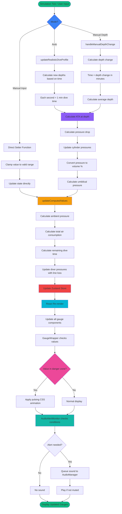

# 🌊 Scuba Diving Simulation Dashboard

A professional React-based dashboard for scuba diving training and simulation featuring realistic physics calculations, real-time gauges, visual/audio alerts, and comprehensive dive analytics.

## ✨ Features Overview

### 🎛️ Dual Operation Modes

#### **Manual Mode**
- Direct control of all gauge values for training scenarios
- Manual depth sliders for both divers with 5-meter increments
- Direct pressure and volume inputs for cylinders
- **Manual Depth Change Assumption**: Each 10 meters of depth change = 10 minutes of dive time
- Real-time gas consumption calculation during manual depth adjustments
- Individual cylinder pressure updates based on diver depth changes

#### **Auto Mode**
- Physics-based simulation with realistic dive profiles
- Automatic depth progression: 0→10→20→30→40→30→20→10→0 meters
- Depth changes every 10 seconds (each second = 1 minute of real dive time)
- Continuous gas consumption calculations based on realistic diving physics
- Automatic umbilical pressure adjustment with depth

### 📊 Real-Time Gauge System

#### **Umbilical Pressure Gauge** (0-30 bar)
- **Safe Range**: 7-20 bar (green zone)
- **Danger Zones**: <7 bar or >20 bar (red zones with pulsing alert)
- **Depth Dependency**: Pressure = 10 + (Depth / 10)
  - At surface (0m): 10 bar
  - At 10m: 11 bar
  - At 20m: 12 bar
  - At 40m: 14 bar
- Visual alert: Pulsing red glow when outside safe range
- Audio alert: Warning beeps when out of range

#### **Diver Pressure Gauges** (0-250 bar)
- Individual pressure monitoring for each diver
- **Color Zones**:
  - Green: 150-250 bar (safe)
  - Orange: 100-150 bar (caution)
  - Red: 0-100 bar (danger)
- Line loss compensation: Umbilical Pressure - (0.5 × Depth)
- Smooth needle animations (400ms transition)

#### **Cylinder Pressure Gauges** (0-200 bar)
- Tracks actual cylinder pressure in bars
- **Alert Threshold**: <20 bar (pulsing red warning)
- **Color Zones**:
  - Green: 140-200 bar (full)
  - Orange: 80-140 bar (moderate)
  - Red: 0-80 bar (low)
- **Diver-Cylinder Mapping**:
  - Diver 1 → Cylinder 1
  - Diver 2 → Cylinder 2
- Real-time depletion based on depth and time

#### **Cylinder Volume Gauges** (0-100%)
- Percentage representation of remaining air
- Automatic conversion from pressure: Volume% = (Pressure / 200) × 100
- Color-coded zones matching pressure gauges
- Low volume warning at 20%

#### **Dive Time Remaining Gauge**
- Calculated based on current depth and remaining pressure
- Formula: (Pressure × CylinderVolume) / (ATA × RMV)
- Updates continuously as depth and pressure change
- Shows realistic time available at current consumption rate

#### **Diver Depth Gauges** (0-40 meters)
- Individual depth tracking for each diver
- **Color Zones**:
  - Green: 0-20m (safe recreational depth)
  - Orange: 20-30m (deeper recreational)
  - Red: 30-40m (technical diving range)
- Manual control via sliders with 5-meter steps
- Automatic depth progression in auto mode

### 🔊 Audio Alert System

#### **Alert Types**
1. **Cylinder Pressure Alerts**
   - Low Pressure (<20 bar): Intermittent warning beeps
   - Critical Pressure (<10 bar): Rapid continuous beeping

2. **Umbilical Pressure Alerts**
   - Outside Safe Range (not 7-20 bar): Warning beeps
   - Prevents overlap with smart queueing system

3. **Dive Time Alerts**
   - Low Time (<5 min): Warning notification
   - Critical Time (<2 min): Urgent alert

#### **Audio Controls**
- 🔊 Mute/Unmute toggle button
- Automatic audio initialization on user interaction
- Sound queue prevents overlapping alerts
- State tracking prevents duplicate alerts

### 🎨 Visual Alert System

#### **Pulsing Red Glow Animation**
- Applied to gauges in danger zones
- CSS keyframe animation with shadow effects
- 1.5-second pulse cycle
- Activated when:
  - Cylinder pressure < 20 bar
  - Umbilical pressure outside 7-20 bar range
  - Any gauge in red zone

#### **Min/Max Labels**
- Displayed below each gauge
- Shows operational range (e.g., "0 bar" - "200 bar")
- Helps users understand gauge scales
- Styled in muted gray for clarity

### 🧮 Realistic Diving Physics

#### **Core Physics Formulas**

1. **Absolute Pressure (ATA)**
   ```
   ATA = (Depth / 10) + 1

   Examples:
   - Surface (0m): 1 ATA
   - 10m depth: 2 ATA
   - 20m depth: 3 ATA
   - 40m depth: 5 ATA
   ```

2. **Gas Consumption Rate**
   ```
   Pressure Drop (bar/min) = (ATA × RMV) / Cylinder Volume

   Constants:
   - RMV (Respiratory Minute Volume): 15 L/min
   - Cylinder Volume: 25 Liters
   - Starting Pressure: 200 bar

   Example at 20m depth:
   - ATA = 3
   - Consumption = (3 × 15) / 25 = 1.8 bar/min
   ```

3. **Remaining Dive Time**
   ```
   Time (minutes) = (Current Pressure × Cylinder Volume) / (ATA × RMV)

   Example with 100 bar at 20m:
   - ATA = 3
   - Time = (100 × 25) / (3 × 15) = 55.6 minutes
   ```

4. **Umbilical Pressure Calculation**
   ```
   Umbilical Pressure = 10 + (Depth / 10)

   Examples:
   - 0m: 10 bar
   - 10m: 11 bar
   - 20m: 12 bar
   - 40m: 14 bar
   ```

5. **Diver Pressure with Line Loss**
   ```
   Diver Pressure = Umbilical Pressure - (0.5 × Depth)

   Example at 20m with 12 bar umbilical:
   - Line Loss = 0.5 × 20 = 10 bar
   - Diver Pressure = 12 - 10 = 2 bar
   ```

#### **Time Simulation**
- **Auto Mode**: Each simulation second = 1 minute of real dive time
- **Manual Mode**: 10 meters depth change = 10 minutes elapsed
- Gas consumption calculated using average depth during transitions

### 📈 Analytics & Monitoring

#### **Computed Metrics Display**
- **Ambient Pressure**: Real-time ATA calculation
- **Total Air Used**: Cumulative consumption in L/min
- **Remaining Dive Time**: Based on current conditions
- All metrics update continuously with simulation

#### **Historical Charts**
- Depth progression over time
- Pressure trends and variations
- Time-series visualization with Recharts
- 60 data points (1-minute history)

#### **Alert Log System**
- Real-time warning notifications
- Color-coded alerts (warning/critical)
- Auto-dismiss after 10 seconds
- Persistent critical alerts until resolved

### 🎮 Control Panel Features

#### **Mode Selection**
- Toggle between Manual and Auto modes
- Start/Stop/Reset controls for auto simulation
- Emergency leak simulation button
- Session timer display

#### **Manual Controls (Manual Mode)**
- Direct pressure inputs for all gauges
- Range validation and clamping
- Instant updates to all dependent gauges
- Real-time recalculation of derived values

#### **Depth Controls (Both Modes)**
- Individual sliders for each diver
- 5-meter step increments (0, 5, 10, 15... 40m)
- Disabled during auto simulation
- Gas consumption on manual adjustment
- Visual legend explaining time assumptions

## 🏗️ System Architecture

### State Update Flow



## 🚀 Getting Started

### Prerequisites
- Node.js 16+
- npm or yarn

### Node.js Installation

#### macOS (Current System)
**Using Homebrew (recommended):**
```bash
# Install Homebrew if you don't have it
/bin/bash -c "$(curl -fsSL https://raw.githubusercontent.com/Homebrew/install/HEAD/install.sh)"

# Install Node.js
brew install node
```

**Official Installer:**
1. Visit [nodejs.org](https://nodejs.org/)
2. Download the LTS version for macOS
3. Run the `.pkg` installer

#### Windows
1. Visit [nodejs.org](https://nodejs.org/)
2. Download the LTS version
3. Run the installer and follow the setup wizard
4. Verify installation:
   ```bash
   node --version
   npm --version
   ```

#### Linux (Ubuntu/Debian)
```bash
# Update package index
sudo apt update

# Add NodeSource repository
curl -fsSL https://deb.nodesource.com/setup_lts.x | sudo -E bash -

# Install Node.js
sudo apt-get install -y nodejs
```

#### Using Node Version Manager (NVM) - All Platforms
```bash
# Install NVM
curl -o- https://raw.githubusercontent.com/nvm-sh/nvm/v0.39.0/install.sh | bash

# Restart terminal or run:
source ~/.bashrc

# Install latest LTS version
nvm install --lts

# Use the installed version
nvm use --lts
```

### Project Installation

```bash
# Navigate to project directory
cd /Users/chandanparameshwarappa/Desktop/react_gauge

# Install dependencies
npm install

# Start development server
npm start
```

The application will open at `http://localhost:3000`

## 📖 User Guide

### Manual Mode Usage

1. **Select Manual Mode**
   - Click the "Manual" button in the control panel
   - All gauge controls become active

2. **Adjust Diver Depths**
   - Use the depth sliders for each diver
   - Steps of 5 meters (0, 5, 10, 15... 40)
   - **Important**: Moving slider by 10m = 10 minutes of dive time
   - Gas consumption automatically calculated

3. **Set Cylinder Pressures**
   - Enter pressure values in bars (0-200)
   - Changes apply instantly to gauges
   - Volume percentage updates automatically

4. **Monitor Gauges**
   - Watch for pulsing red warnings
   - Listen for audio alerts
   - Check computed metrics panel

### Auto Mode Usage

1. **Select Auto Mode**
   - Click the "Auto" button in the control panel
   - Manual controls become disabled

2. **Start Simulation**
   - Click "Start Simulation"
   - Session timer begins
   - Depths change every 10 seconds

3. **Observe Dive Profile**
   - Depths progress: 0→10→20→30→40→30→20→10→0m
   - Each second simulates 1 minute of real diving
   - Gas consumption calculated continuously

4. **Monitor Conditions**
   - Watch cylinder pressures decrease
   - Observe umbilical pressure adjust with depth
   - Check remaining dive time

5. **Emergency Simulation**
   - Click "Trigger Leak" for emergency scenario
   - Immediate pressure drops in umbilical and diver 1
   - Practice emergency response

### Understanding Alerts

#### Visual Alerts (Pulsing Red Glow)
- **Cylinder Pressure**: <20 bar
- **Umbilical Pressure**: Outside 7-20 bar range
- **Gauge in Red Zone**: Any gauge showing red

#### Audio Alerts
- **Low Cylinder**: <20 bar (intermittent beeps)
- **Critical Cylinder**: <10 bar (rapid beeps)
- **Umbilical Out of Range**: Not 7-20 bar (warning)
- **Low Dive Time**: <5 minutes (alert)
- **Critical Time**: <2 minutes (urgent)

#### Mute/Unmute
- Click the audio button in header
- 🔊 = Audio On
- 🔇 = Muted

## 📁 Project Structure

```
react_gauge/
├── src/
│   ├── components/
│   │   ├── Analytics/
│   │   │   ├── ComputedMetrics.js          # Real-time calculations display
│   │   │   ├── HistoricalCharts.js         # Time-series visualizations
│   │   │   └── AlertLog.js                 # Alert history and notifications
│   │   ├── ControlPanel/
│   │   │   ├── ModeSelector.js             # Manual/Auto mode toggle
│   │   │   ├── SimulationControls.js       # Start/Stop/Reset buttons
│   │   │   ├── ManualInputPanel.js         # Direct gauge value inputs
│   │   │   └── DiverDepthControls.js       # Depth sliders with gas consumption
│   │   ├── Gauges/
│   │   │   ├── GaugeWrapper.js             # Alert logic and labels wrapper
│   │   │   ├── UmbilicalPressure.js        # Depth-dependent pressure gauge
│   │   │   ├── DiverPressure.js            # Line-loss compensated pressure
│   │   │   ├── CylinderPressure.js         # Actual pressure in bars
│   │   │   ├── CylinderVolume.js           # Percentage representation
│   │   │   ├── DiveTimeRemaining.js        # Calculated time available
│   │   │   └── DiverDepth.js               # Individual depth gauges
│   │   ├── UI/
│   │   │   ├── AudioAlertMonitor.js        # Audio system integration
│   │   │   └── SessionTimer.js             # Elapsed time display
│   │   └── Dashboard.js                     # Main layout component
│   ├── store/
│   │   └── divingStore.js                   # Zustand state management
│   │       ├── State variables
│   │       ├── Setter functions
│   │       ├── handleManualDepthChange()    # Manual depth with gas consumption
│   │       ├── updateRealisticDiveProfile() # Auto mode simulation
│   │       └── updateComputedValues()       # Recalculate all derived values
│   ├── utils/
│   │   ├── calculations.js                  # All physics formulas
│   │   │   ├── calculateATA()
│   │   │   ├── calculatePressureDropPerSecond()
│   │   │   ├── calculateNewCylinderPressure()
│   │   │   ├── calculateRemainingDiveTimeRealistic()
│   │   │   ├── calculateUmbilicalPressure()
│   │   │   └── calculateDiverPressure()
│   │   ├── constants.js                     # Configuration and initial state
│   │   │   ├── SIMULATION_CONSTANTS
│   │   │   ├── INITIAL_STATE
│   │   │   ├── ALERT_TYPES
│   │   │   └── UI_CONSTANTS
│   │   └── audioManager.js                  # Web Audio API sound generation
│   │       ├── handleCylinderPressureAlert()
│   │       ├── handleUmbilicalPressureAlert()
│   │       ├── handleDiveTimeAlert()
│   │       └── Sound queue management
│   └── styles/
│       ├── theme.css                        # CSS variables and animations
│       │   ├── Pulsing red glow keyframes
│       │   └── Gauge label styles
│       └── [component styles]
└── package.json                             # Dependencies and scripts
```

## 🔬 Technical Implementation Details

### State Management (Zustand)

The application uses Zustand for centralized state management with the following key features:

```javascript
// divingStore.js structure
const useDivingStore = create((set, get) => ({
  // State variables
  mode: 'manual',
  isRunning: false,
  diver1Depth: 0,
  diver2Depth: 0,
  cylinder1Pressure: 200,
  cylinder2Pressure: 200,
  umbilicalPressure: 10,
  // ... more state

  // Setter functions with automatic conversions
  setCylinder1Pressure: (pressure) => {
    const volume = (pressure / 200) * 100;
    set({ cylinder1Pressure: pressure, cylinder1Volume: volume });
  },

  // Manual depth change with gas consumption
  handleManualDepthChange: (diverNumber, oldDepth, newDepth, timePassed) => {
    const avgDepth = (oldDepth + newDepth) / 2;
    const newPressure = calculateNewCylinderPressure(current, avgDepth, timePassed);
    // Update state and recalculate
  },

  // Auto simulation update
  updateRealisticDiveProfile: (elapsedTime) => {
    const interval = Math.floor(elapsedTime / 10000);
    const newDepth = calculateDepthForInterval(interval);
    const newPressure = calculateNewCylinderPressure(current, newDepth, 1);
    // Update all values
  },

  // Recalculate all computed values
  updateComputedValues: () => {
    const umbilical = calculateUmbilicalPressure(depth);
    const remainingTime = calculateRemainingDiveTimeRealistic(pressure, depth);
    // Update all derived values
  }
}));
```

### Physics Calculations Module

All diving physics are implemented in `utils/calculations.js`:

```javascript
// Key calculation functions

// Absolute pressure at depth
export const calculateATA = (depth) => (depth / 10) + 1;

// Pressure drop per simulation second (1 sec = 1 min)
export const calculatePressureDropPerSecond = (depth, rmv = 15, cylinderVolume = 25) => {
  const ata = calculateATA(depth);
  return (ata * rmv) / cylinderVolume;
};

// New cylinder pressure after consumption
export const calculateNewCylinderPressure = (currentPressure, depth, timeElapsed = 1, rmv = 15, cylinderVolume = 25) => {
  const pressureDropPerSecond = calculatePressureDropPerSecond(depth, rmv, cylinderVolume);
  const newPressure = currentPressure - (pressureDropPerSecond * timeElapsed);
  return Math.max(0, newPressure);
};

// Remaining dive time calculation
export const calculateRemainingDiveTimeRealistic = (remainingPressure, depth, rmv = 15, cylinderVolume = 25) => {
  if (remainingPressure <= 0) return 0;
  const ata = calculateATA(depth);
  const consumptionRateAtDepth = ata * rmv;
  const totalAirAvailable = remainingPressure * cylinderVolume;
  return totalAirAvailable / consumptionRateAtDepth;
};

// Umbilical pressure varies with depth
export const calculateUmbilicalPressure = (depth) => 10 + (depth / 10);
```

### Audio System Architecture

The `AudioManager` class uses Web Audio API for programmatic sound generation:

```javascript
class AudioManager {
  constructor() {
    this.audioContext = null;
    this.soundQueue = [];
    this.isPlaying = false;
    this.isMuted = false;
    this.lastAlertStates = {};
  }

  // Initialize on user interaction (browser requirement)
  initialize() {
    this.audioContext = new (window.AudioContext || window.webkitAudioContext)();
  }

  // Play tone with frequency and duration
  playTone(frequency, duration) {
    const oscillator = this.audioContext.createOscillator();
    const gainNode = this.audioContext.createGain();
    oscillator.connect(gainNode);
    gainNode.connect(this.audioContext.destination);
    oscillator.frequency.value = frequency;
    oscillator.start();
    oscillator.stop(this.audioContext.currentTime + duration);
  }

  // Queue system prevents overlapping
  queueSound(soundFunction) {
    this.soundQueue.push(soundFunction);
    if (!this.isPlaying) this.processQueue();
  }

  // Alert handlers check state changes
  handleCylinderPressureAlert(pressure1, pressure2) {
    const isLowPressure = pressure1 < 20 || pressure2 < 20;
    if (isLowPressure !== this.lastAlertStates.cylinderLow) {
      this.lastAlertStates.cylinderLow = isLowPressure;
      if (isLowPressure) this.queueSound(() => this.playWarningBeep());
    }
  }
}
```

### Visual Alert System

The `GaugeWrapper` component centralizes alert logic:

```javascript
const GaugeWrapper = ({
  currentValue,
  alertThreshold = null,
  safeRangeMin = null,
  safeRangeMax = null,
  // ... other props
}) => {
  let shouldAlert = false;

  // Range-based alert (e.g., umbilical 7-20 bar)
  if (safeRangeMin !== null && safeRangeMax !== null) {
    shouldAlert = currentValue > 0 &&
                  (currentValue < safeRangeMin || currentValue > safeRangeMax);
  }
  // Threshold-based alert (e.g., cylinder <20 bar)
  else if (alertThreshold !== null) {
    shouldAlert = currentValue < alertThreshold && currentValue > 0;
  }

  // Apply CSS class for pulsing animation
  const gaugeClassName = shouldAlert ? 'gauge-alert' : '';

  return (
    <div className={gaugeClassName}>
      {children}
      {showLabels && (
        <div className="gauge-labels">
          <span>{minValue} {unit}</span>
          <span>{maxValue} {unit}</span>
        </div>
      )}
    </div>
  );
};
```

### CSS Animation

Pulsing red glow effect in `theme.css`:

```css
.gauge-alert {
  animation: pulseRedGlow 1.5s ease-in-out infinite;
}

@keyframes pulseRedGlow {
  0%, 100% {
    border-color: var(--status-red);
    box-shadow: 0 8px 32px var(--shadow-color),
                0 0 20px rgba(239, 68, 68, 0.6),
                inset 0 1px 0 rgba(255, 255, 255, 0.1);
  }
  50% {
    border-color: rgba(239, 68, 68, 0.8);
    box-shadow: 0 8px 32px var(--shadow-color),
                0 0 40px rgba(239, 68, 68, 0.9),
                0 0 60px rgba(239, 68, 68, 0.5),
                inset 0 1px 0 rgba(255, 255, 255, 0.1);
  }
}
```

## 🎯 Use Cases

### Training Applications
- **Dive Planning**: Practice calculating gas consumption for different depths
- **Emergency Response**: Simulate equipment failures and practice responses
- **Equipment Familiarization**: Learn to read and interpret diving gauges
- **Safety Protocols**: Practice monitoring alerts and taking corrective action
- **Manual Depth Control**: Plan dive profiles with realistic gas consumption

### Educational Features
- **Physics Demonstration**: See real-time application of diving physics formulas
- **Depth Effects**: Understand how depth increases gas consumption exponentially
- **Pressure Relationships**: Learn about umbilical, diver, and cylinder pressures
- **Data Analysis**: Review historical dive data and analyze patterns
- **Alert Response**: Practice responding to visual and audio warnings

## 🔧 Configuration

### Simulation Constants

Key constants can be adjusted in `src/utils/constants.js`:

```javascript
export const SIMULATION_CONSTANTS = {
  // Physics Constants
  RMV: 15,                        // Respiratory Minute Volume (L/min)
  CYLINDER_VOLUME_LITERS: 25,     // Cylinder size (Liters)
  START_PRESSURE_BAR: 200,        // Initial pressure (bar)
  LINE_LOSS_FACTOR: 0.5,          // Pressure loss per meter

  // Simulation Timing
  UPDATE_INTERVAL: 1000,          // 1 second = 1 minute dive time
  HISTORY_LENGTH: 60,             // Data points to keep

  // Alert Thresholds
  LOW_CYLINDER_THRESHOLD: 20,     // 20 bar warning
  LOW_PRESSURE_THRESHOLD: 10,     // 10 bar critical

  // Safe Ranges
  UMBILICAL_SAFE_RANGE: { min: 7, max: 20 },

  // Gauge Ranges
  DEPTH_RANGE: { min: 0, max: 40 },
  UMBILICAL_PRESSURE_RANGE: { min: 0, max: 30 },
  DIVER_PRESSURE_RANGE: { min: 0, max: 250 },
  CYLINDER_PRESSURE_RANGE: { min: 0, max: 200 }
};
```

## 🐛 Troubleshooting

### Common Issues

**Audio Not Working**
- Ensure audio is unmuted (🔊 button)
- Browser may require user interaction to enable audio
- Check browser's autoplay policy settings

**Gauges Not Updating**
- Check that simulation is running (Auto mode)
- Verify manual inputs are within valid ranges
- Check browser console for errors

**Performance Issues**
- Reduce HISTORY_LENGTH in constants
- Close other browser tabs
- Check system resources

## 🤝 Contributing

1. Fork the repository
2. Create a feature branch (`git checkout -b feature/amazing-feature`)
3. Make your changes following the existing code style
4. Test thoroughly in both Manual and Auto modes
5. Commit your changes (`git commit -m 'Add amazing feature'`)
6. Push to the branch (`git push origin feature/amazing-feature`)
7. Open a Pull Request

## 📝 License

This project is licensed under the MIT License - see the [LICENSE](LICENSE) file for details.

## 🙏 Acknowledgments

- Built with realistic diving physics for professional training
- Designed with safety and accuracy as top priorities
- Inspired by real-world commercial diving operations
- Uses industry-standard diving calculations and formulas

---

**⚠️ Disclaimer**: This is a simulation tool for training and educational purposes only. Always follow proper diving procedures, use certified equipment, and obtain appropriate training before engaging in actual diving operations. This tool is not a substitute for professional diving instruction or certified equipment.

**💡 For Questions or Issues**: Check the browser console for detailed error messages, verify Node.js installation, and ensure all dependencies are installed with `npm install`.
